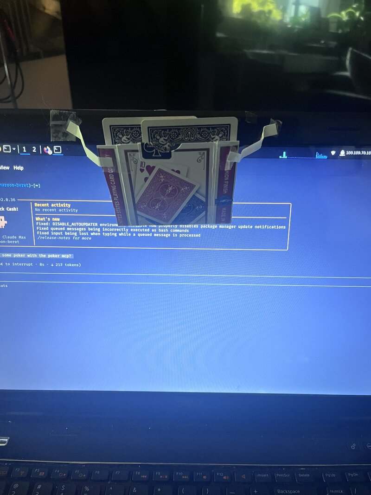
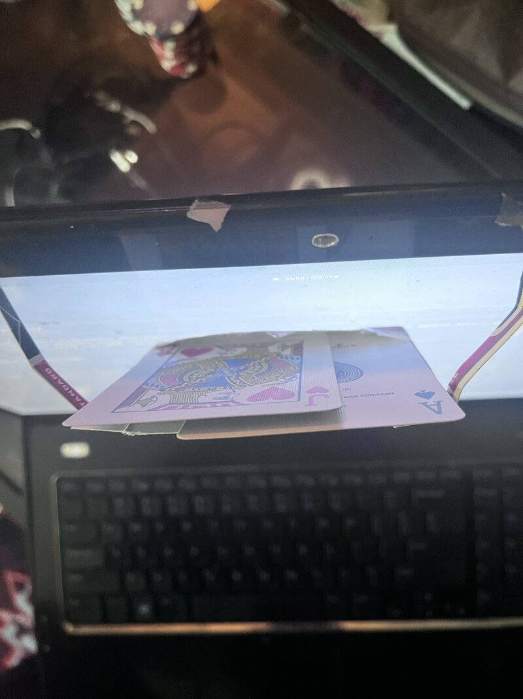

# Claude Poker

An autonom-ish poker player for live physical tables. Claude plays its own hands, sees its cards via webcam, speaks decisions aloud, and throws in some table talk. Built on Claude Code's MCP protocol.

## Features

- **Autonom-ish Play** - Claude makes its own decisions (you just relay the action)
- **Webcam Card Capture** - Sees its hole cards via webcam, keeps them secret
- **Voice Output** - Neural TTS via Piper (British voice)
- **Game State Tracking** - Remembers opponents, tendencies, chip stacks across sessions
- **Table Talk** - Strategic banter and psychology

## Setup

### 1. Clone and Install

```bash
git clone https://github.com/RED-BASE/claude-poker.git
cd claude-poker
python3 -m venv venv
source venv/bin/activate
pip install -r requirements.txt
```

### 2. System Dependencies

```bash
# Webcam capture
sudo apt-get install ffmpeg v4l-utils

# Optional: phone voice input
sudo apt-get install xdotool
```

### 3. Piper TTS

```bash
mkdir -p ~/piper ~/.local/share/piper/voices
wget https://github.com/rhasspy/piper/releases/download/v1.2.0/piper_amd64.tar.gz
tar -xzf piper_amd64.tar.gz -C ~/piper

wget https://huggingface.co/rhasspy/piper-voices/resolve/v1.0.0/en/en_GB/alan/medium/en_GB-alan-medium.onnx \
  -O ~/.local/share/piper/voices/en_GB-alan-medium.onnx
```

### 4. Register MCP Server

```bash
claude mcp add claude-poker
```

When prompted:
- **Command**: `~/claude-poker/venv/bin/python3`
- **Arguments**: `~/claude-poker/poker-mcp-server.py`

## Usage

### Game Flow

1. **Setup game** (assigns seats):
   ```
   "Setup game: Bob has 500 chips, Mike has 300 chips, Claude has 400 chips"
   ```

2. **New hand** (rotates button):
   ```
   "New hand"
   ```

3. **Capture cards**:
   ```
   "Capture my cards"
   ```

4. **Action to Claude**:
   ```
   "Pot is 20, Mike bet 15, what do you do?"
   ```

5. **Claude responds** via voice with decision and reasoning.

### MCP Tools

- `mcp_setup_game()` - Initialize players and chip stacks
- `mcp_capture_cards()` - Webcam capture of hole cards
- `mcp_update_game_state()` - Track pot, actions, community cards
- `mcp_poker_speak()` - Voice output via Piper TTS

### Architecture

```
Smartphone (optional)
    │ HTTP :5000
    ▼
Flask Server ──► Claude Code + MCP ──► Poker MCP Server ──► Piper TTS
                                              │
                                         Webcam Capture
```

### Data Persistence

Saves to `~/.claude-poker/`:
- `player_stats.json` - Long-term opponent tendencies (persists across sessions)
- `current_game.json` - Current session state (resets each game)

Claude remembers that Bob is a tight player from last week.

### Card Holder Setup

Position a card holder in front of your webcam:


*Webcam captures from above*


*Cards should be flat and well-lit*

## License

MIT

## Author

Built by Cassius Oldenburg - [@RED-BASE](https://github.com/RED-BASE)
